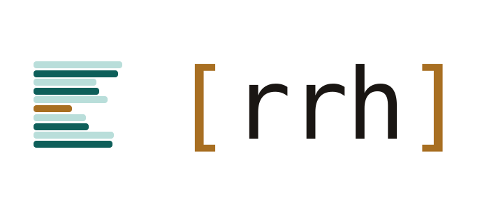

<picture>
  <source media="(prefers-color-scheme: dark)" srcset="assets/rrh-wordmark-brackets-dark.svg">
  
</picture>

**A regression test for a system that gives different answers to the same question.**

Changing the chunk size of a retrieval pipeline changes which passages come back, and with them the answers.
The test suite still passes, because the pipeline is intact: it returns a paragraph with a source attached, the way it did before.
What the suite cannot tell me is whether that answer still comes from the part of the corpus it should.

The unit of work here is a recorded run.
Each run is stored together with the configuration it ran under and with the chunks it retrieved, including score and rank.
Running the same gold questions against two configurations then produces a diff, question by question.
The chunk list is the part I work with: it shows which passage an answer was assembled from, so a change has a traceable place to start.

## Why this exists

Retrieval quality is the first thing I look at when a RAG answer goes wrong, and it is the thing that is hardest to see afterwards.
The pipeline reports an answer, not the passages it was built from, and the previous run is gone by the time the new one finishes.

So the comparison usually happens by reading two answers side by side and forming an impression.
That works for obvious breakage and stops working at the point where it matters, when one configuration is slightly better on some questions and slightly worse on others.

This harness keeps enough of each run to replace that impression with a diff.
The [RAGGY paper](https://arxiv.org/abs/2504.13587) describes the same working pattern from the other direction: developers debugging RAG pipelines check retrieval first, want to see which chunks were and were not returned, and compare strategies against each other.

## Status

**Phase 2, in progress.** There is nothing to install yet and nothing to point at a corpus.
The harness itself does not exist: no documents, no chunks, no embeddings, no database, no runs, no diff.

What exists is the layer underneath it, the service skeleton and the raw LLM calls the pipeline gets built into:

- A FastAPI service with `/health`, `/version` and `/analyze`
- `OpenAiLlmClient` behind an `LlmClient` protocol, wired through FastAPI's `Depends`
- Error classification split into `LlmConfigurationError` (500) and `LlmUnavailableError` (502), so the status code carries who has to act on it
- `LlmConfig` as a pydantic model, passed into the pipeline rather than read from a global
- 32 tests, `mypy --strict` and `pyright --strict` clean

Retrieval, the schema and the first diff are phase 3.
The [roadmap](#roadmap) says what lands when.

## Why there is nothing to assert

A unit test names an input and the output it expects.
Retrieval does not hand me that pair.
The same question against the same corpus returns a different set of passages once the embedding model or the chunk size changes, and there is no correct set I could write down beforehand.

What I can observe is the direction of a change.
If a question was answered from the section I expected before a configuration change, and from a different one after, that is a regression I can name, whether or not the generated text still reads well.

Reading that direction requires the earlier run to still be around in enough detail to compare against.
The retrieved passages, their scores and their ranks usually do not outlive the request they were made for.
Here they are written down, and the diff reads them later.

## Approach

## What a run records

| Recorded                                                       | Why it is kept                                                                                          |
|----------------------------------------------------------------|---------------------------------------------------------------------------------------------------------|
| The configuration it ran under                                 | A run I cannot reproduce is a run I cannot compare against.                                             |
| Every retrieved chunk, with score and rank                     | Shows which passage an answer was assembled from, and how close the ones below it came.                 |
| The gold question, its expected answer and its expected source | The expected source is what makes a retrieval metric possible. Without it I can judge the answer alone. |
| The computed scores                                            | The layer the diff is calculated on.                                                                    |

Four things are allowed to vary between runs:

- **Chunk size and overlap** - how the corpus is cut before it is embedded
- **Embedding model** - which vector space the comparison happens in
- **`top_k` and `ef_search`** - how many candidates come back, and how hard the index looks for them
- **Prompt version** - the instruction the retrieved context is handed to

The provider is one of these settings as well.
The OpenAI client speaks to any OpenAI-compatible endpoint through a different `base_url`, so moving to Groq changes a value and leaves the layer alone.

### The configuration dimensions

Four dimensions, deliberately, and one corpus:

- **Chunk size and overlap** - how the corpus is cut before it is embedded
- **Embedding model** - which vector space the comparison happens in
- **`top_k` and `ef_search`** - how many candidates are retrieved, and how hard the index looks for them
- **Prompt version** - the instruction the retrieved context is handed to

The provider is a configuration value here, not an architectural decision.
The OpenAI client speaks to any OpenAI-compatible endpoint through a different `base_url`, so a fallback to Groq changes a setting rather than a layer.

## Design decisions

### Why pgvector on PostgreSQL rather than a dedicated vector store

The data this project produces is relational before it is vectorial.
Almost every question it answers is a join: runs against questions, questions against retrievals, retrievals against chunks, chunks against scores, then aggregated per run and compared across two runs.
That is the shape of the workload, and PostgreSQL is built for it.

A dedicated vector store holds vectors with a payload attached.
It retrieves nearest neighbours well, and for a pipeline whose job ends at retrieval that is the better fit.
Here the retrieval result is the input to the analysis rather than the output of the system, so choosing one would mean running a second database next to Postgres and moving the joins into Python.
Two stores to keep consistent, and aggregation code written by hand where SQL already does it.

The volume argument points the same way.
One corpus of framework documentation across a handful of configurations is not a scale at which a specialised engine earns its operational cost.

What it gives up is real: dedicated stores offer richer filtering, hybrid search and sharding out of the box, and pgvector's index tuning is coarser in comparison.
None of those limits bind at this size, and the decision is reversible, because the embeddings are one table.

<!-- TODO Felix: die drei folgenden Begruendungen selbst schreiben. Stichworte sind da, Laenge und Zuschnitt wie bei pgvector oben: erst die eigene Entscheidung, dann was sie kostet. 

### Why one row per chunk and model, not one column per model

> **Noch zu schreiben.**
> Stichworte: eine `vector`-Spalte hat feste Dimension. Verschiedene Embedding-Modelle liefern unterschiedlich lange Vektoren. Die Kombinationszeile ist relational normal und zugleich genau die Struktur, die der Modellvergleich ohnehin braucht. Was sie kostet: mehr Zeilen, ein Join mehr pro Abfrage.

### Why `ef_search` is its own dimension

> **Noch zu schreiben.**
> Stichworte: HNSW und IVFFlat sind approximativ, nicht exakt. Sie liefern nicht garantiert die tatsaechlich naechsten Nachbarn. `ef_search` tauscht Trefferquote gegen Latenz. Analogie aus dem eigenen Stack: ein nicht-abdeckender Index in SQL Server wird zwar benutzt, zieht aber Key Lookups nach sich. Deshalb gehoert der Parameter in den Diff und nicht in die Fussnote.

### What LangChain takes over

> **Noch zu schreiben.**
> Stichworte: Die Pipeline entsteht zuerst von Hand, LangChain kommt danach als zusaetzliche Konfigurationsdimension dazu. Damit wird die Antwort auf "was nimmt das Framework ab" ein Diff aus zwei Laeufen statt einer Behauptung. Framework-Wahl selbst ist strategisch begruendet, nicht fachlich.

-->

## Planned

Nothing in this section exists yet. It is the design phase 3 gets built against.

### The data model

| Table        | Holds                                                                     |
|--------------|---------------------------------------------------------------------------|
| `documents`  | The source documents of the corpus.                                       |
| `chunks`     | Cut documents, pointing at the chunking configuration that produced them. |
| `embeddings` | One row per combination of chunk and model.                               |
| `questions`  | Gold questions with expected answer and expected source.                  |
| `runs`       | One row per run, with its configuration frozen at the time it ran.        |
| `retrievals` | Per run and question, the retrieved chunks with score and rank.           |
| `scores`     | The computed metrics the diff reads.                                      |

The diff is a self-join over `scores` on two `run_id`s.

### The corpus

The corpus is the technical documentation of a framework from this project's own stack: FastAPI, LangChain, SQLAlchemy or pgvector.
It is picked for how hard it is to retrieve from, because a corpus that is easy to search flattens the diffs and leaves the tool with little to show.

Three properties make documentation hard in a useful way:

- **Near-duplicates.** API reference entries are uniform by design and differ only in details.
- **Terminology collisions.** "client", "session" and "context" mean different things depending on the section.
- **Split answers.** The explanation and the code example often live in different sections and have to be pulled together.

Staying inside the target stack has a second reason.
Gold questions need an expected answer and an expected source, and I can only write those for a subject I can judge myself.

### Scope

Four configuration dimensions, one corpus, a report as output, no user interface.

Set aside deliberately:

- **A 3D projection of the vector space** (t-SNE, UMAP). These preserve local neighbourhoods but not global distances, so cluster sizes and gaps in the picture are artefacts of the projection. As a diagnostic it would not hold up.
- **Multi-agent orchestration.** A single flow holding state across two or three tools covers the pattern this project needs.
- **A second corpus.** The comparison runs between configurations. A second corpus adds a variable without adding an answer.

## Roadmap

Each phase leaves something that runs.

### Phase 1 - The service skeleton ✅

A FastAPI service written by hand, with pydantic models and a pytest suite from the first endpoint on.
It exists to have somewhere for the LLM layer to sit, and it is what `/health`, `/version` and the test setup come from.

### Phase 2 - The raw LLM layer (in progress)

Direct API calls without a framework: messages, system prompts, streaming, structured outputs validated against pydantic, and tool calling.
The configuration object comes first in this phase, ahead of the code that would otherwise hard-wire its values.
Gold questions are defined here as a typed structure, ahead of the database that will hold them.

### Phase 3 - Retrieval and the harness

The pipeline built by hand first: ingestion, chunking, retrieval, generation.
Then pgvector on PostgreSQL, the schema through SQLAlchemy and Alembic, and the first diff between two runs.
LangChain enters as an additional configuration dimension rather than as a rewrite.

### Phase 4 - Production concerns

ragas as a scorer writing into the existing `scores` table, LangSmith tracing for cost per run, token budgets and rate limiting, and deployment.

---

> discrimen (Latin) - "a dividing line, a decisive point". Which is exactly what a regression check looks for between two runs.

## License

Licensed under the [MIT License](LICENSE). © 2026 Felix Wahl.

Related: [Chartula](https://github.com/goldbarth/chartula), a grounded changelog CLI in .NET, and [goldbarth.dev](https://www.goldbarth.dev/), where the experiments behind both are written up while they run.